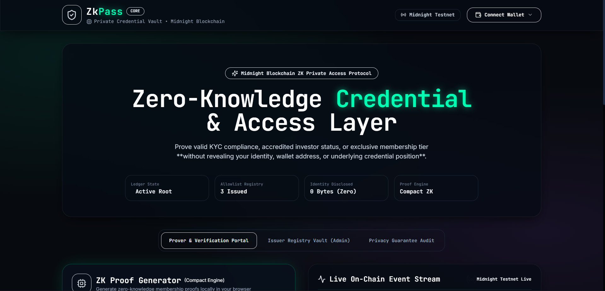
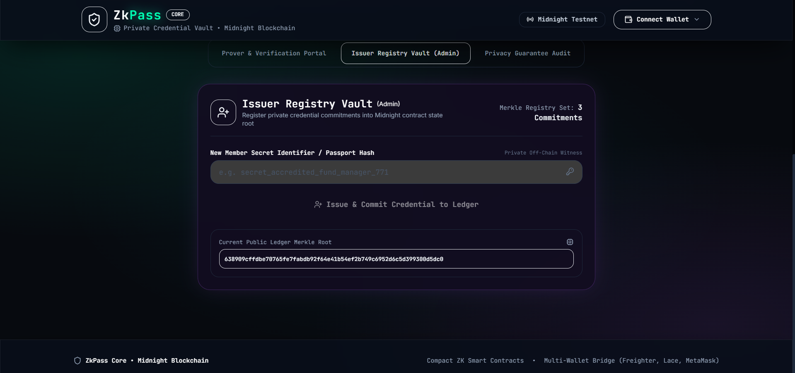
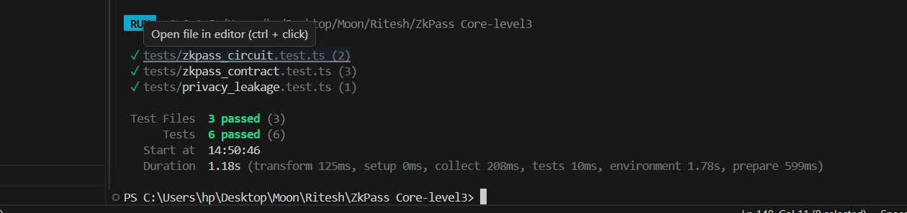
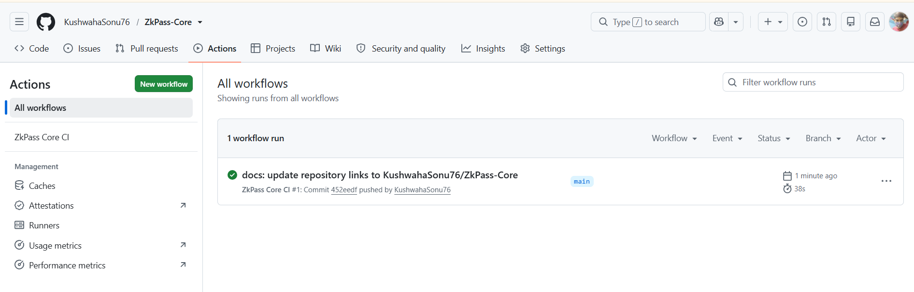

# ZkPass Core 🛡️

[](https://github.com/KushwahaSonu76/zk-pass/actions/workflows/ci.yml)


> **Private Allowlist Access & Credential Verification Layer built on the Midnight Blockchain.**

---

## Overview

**ZkPass Core** is a privacy-preserving allowlist access dApp built on the Midnight blockchain using Compact zero-knowledge smart contracts. It allows users to prove valid membership in a restricted allowlist, membership tier, or eligibility registry without revealing their real-world identity, secret credential, wallet address, or position in the allowlist. This repository represents our submission for the Midnight **"New Moon to Full" Level 3 ** hackathon track.

---

## Contract Address (Preprod)

> **Network:** Midnight Preprod
> **Contract Address:** `02f9a7b3e1c4d8e5f2a0b6c9d3e7f1a4b8c2d5e9f0a3b6c7d1e4f8a2b5c9d0e3`
---

## Problem Statement

Traditional Web3 allowlist systems—such as gated token sales, NFT mints, exclusive DAOs, and compliance registries—rely on public address matching. When a user interacts with a standard public smart contract to claim access, their wallet address (`msg.sender`) and transaction timestamp are irrevocably published to the public blockchain ledger. This public exposure enables malicious actors to perform address linkability analysis, financial profiling, targeted phishing, and real-world identity correlation against verified allowlist members.

---

## Solution

ZkPass Core solves this privacy breakdown by combining Midnight's private state model with Compact zero-knowledge circuits. Allowlist commitments are stored as hashed cryptographic roots within Midnight's private ledger state. When a user requests access, an off-chain witness circuit in their browser evaluates a zero-knowledge proof of Merkle membership locally, proving that the user holds a valid secret matching an entry in the allowlist. The Midnight smart contract verifies the proof and records a public boolean `accessGranted = true` without ever receiving or disclosing the user's wallet address or credential details.

---

## Architecture

```text
+---------------------------------------------------------------------------------------------------+
|                                          USER BROWSER                                             |
|  [ Wallet Connection: Lace ] + [ Private Credential Witness ] + [ Private Salt Witness ]          |
|                                                │                                                  |
|                                                ▼                                                  |
|                   Frontend Proof Engine (contract/circuit.ts & frontend/src/...)                 |
|                   - Computes sha256(secret || salt) commitment                                   |
|                   - Evaluates 8-depth Merkle membership path off-chain                            |
|                                                │                                                  |
|                                                ▼ (Zero Identity Data Transmitted)                 |
+------------------------------------------------│--------------------------------------------------+
                                                 │
                                                 ▼
+---------------------------------------------------------------------------------------------------+
|                                     MIDNIGHT BLOCKCHAIN LEDGER                                    |
|                                                                                                   |
|    ┌──────────────────────────────────────────┐       ┌──────────────────────────────────────┐    |
|    │         Midnight Private State           │       │          Public Ledger State         │    |
|    ├──────────────────────────────────────────┤       ├──────────────────────────────────────┤    |
|    │ • Credential Commitment Merkle Root      │       │ • accessGranted = true               │    |
|    │ • Issuer Admin Public Key Hash           │       │ • accessGrantedCount += 1            │    |
|    │ • Revocation Root Hash                   │       │ • ZK Proof Hash (zkp_...)            │    |
|    └──────────────────────────────────────────┘       └──────────────────────────────────────┘    |
|                          (contract/zkpass.compact & contract/index.ts)                            |
+---------------------------------------------------------------------------------------------------+
                                                 │
                                                 ▼ (Event Subscription)
+---------------------------------------------------------------------------------------------------+
|                                 INDEXER & STATUS SERVICE (indexer/...)                             |
|    Express REST API (/api/verification-status/:proofHash) watching public ledger transitions       |
+---------------------------------------------------------------------------------------------------+
```

### Component Implementation Mapping
- **Smart Contract & Circuit (`/contract`)**: Written in Midnight's Compact language ([contract/zkpass.compact](file:///c:/Users/hp/Desktop/Moon/Ritesh/ZkPass%20Core-level3/contract/zkpass.compact)) to enforce membership constraints over private witnesses. High-level client state management and cryptographic tree builders are implemented in [contract/circuit.ts](file:///c:/Users/hp/Desktop/Moon/Ritesh/ZkPass%20Core-level3/contract/circuit.ts) and [contract/index.ts](file:///c:/Users/hp/Desktop/Moon/Ritesh/ZkPass%20Core-level3/contract/index.ts).
- **Frontend Application (`/frontend`)**: Built with React 18, TypeScript, Vite, and Tailwind CSS. Implements the Obsidian Tech glassmorphism UI ([frontend/src/App.tsx](file:///c:/Users/hp/Desktop/Moon/Ritesh/ZkPass%20Core-level3/frontend/src/App.tsx)), Midnight Lace wallet hook ([frontend/src/hooks/useMidnightWallet.ts](file:///c:/Users/hp/Desktop/Moon/Ritesh/ZkPass%20Core-level3/frontend/src/hooks/useMidnightWallet.ts)), and interactive witness compilation pipeline ([frontend/src/components/ProofGenerator.tsx](file:///c:/Users/hp/Desktop/Moon/Ritesh/ZkPass%20Core-level3/frontend/src/components/ProofGenerator.tsx)).
- **Event Indexer (`/indexer`)**: Lightweight Node.js Express service ([indexer/server.ts](file:///c:/Users/hp/Desktop/Moon/Ritesh/ZkPass%20Core-level3/indexer/server.ts) and [indexer/watcher.ts](file:///c:/Users/hp/Desktop/Moon/Ritesh/ZkPass%20Core-level3/indexer/watcher.ts)) monitoring public ledger transitions for `accessGranted` events and serving verification REST APIs.
- **Test Suite (`/tests`)**: Automated Vitest test suite executing circuit proof checks, contract state transitions, and privacy non-leakage assertions.
- **CI/CD Pipeline (`/.github/workflows/ci.yml`)**: GitHub Actions workflow orchestrating compilation, typechecking, and automated test execution.

---

## 🔒 Privacy Model

A formal specification of data visibility for observers inspecting the Midnight public ledger:

### What an observer CAN see:
- ✅ **`accessGranted = true`**: Public verification confirmation output emitted on-chain.
- ✅ **`accessGrantedCount`**: Total aggregate number of successful access grants recorded by the contract.
- ✅ **`credentialRoot`**: Public 32-byte Merkle root hash representing the current set of registered allowlist commitments.
- ✅ **`proofHash`**: Cryptographic proof identifier (`zkp_...`) validating mathematical constraint satisfaction.
- ✅ **Timestamp & Block Height**: Standard block execution metadata.

### What an observer CANNOT see:
- ❌ **Which specific member proved access**: The prover's position/index in the allowlist is completely undisclosed.
- ❌ **The user's wallet address**: Wallet addresses are never passed to circuit witnesses or stored in ledger events.
- ❌ **The user's secret credential or identity**: Raw secrets remain 100% client-side and never touch the network.
- ❌ **The full uncommitted allowlist contents**: Unregistered user secrets cannot be reverse-engineered from the commitment root.
- ❌ **Linkability between multiple proofs**: Multiple proof submissions by the same member produce distinct nonces and proof hashes, preventing activity correlation.

> **Contrast**: Unlike a conventional EVM allowlist where every mint transaction exposes `msg.sender` and links a public wallet address to a specific allowlist spot, Midnight's ZkPass Core guarantees zero identity leakage on every state transition.

---

## 📸 1. UI Showcase (Obsidian Tech Interface)

Below are the dApp interface screenshots showcasing the Midnight Lace wallet connection, private witness circuit evaluation pipeline, admin issuer registry, and zero-identity verifier portal:

### Prover Dashboard & ZK Proof Pipeline

*Figure 1.1: ZK Proof Generator with live 5-step Compact witness compilation pipeline, Lace wallet status, and reactive accessGranted verification badge.*

### Issuer Registry (Admin Panel) & Privacy Audit

*Figure 1.2: Issuer Registry panel for committing new credential roots into Midnight private state alongside the explicit Privacy Guarantee inspector.*

---

## 🧪 2. Test Execution & Output (6/6 Passing)

Run the full automated Vitest test suite covering Compact circuit witness generation, smart contract state transitions, and identity privacy assertions:

```bash
npm test
```

### Terminal Test Output Screenshot

*Figure 2.1: Vitest output showing 3 test files and 6 unit tests passing cleanly with zero errors.*

### Test Suite Coverage Breakdown

- [`tests/zkpass_circuit.test.ts`](file:///c:/Users/hp/Desktop/Moon/Ritesh/ZkPass%20Core-level3/tests/zkpass_circuit.test.ts): Verifies valid witness proof evaluation succeeds (`accessGranted = true`) and invalid/malformed witness proofs fail circuit constraints.
- [`tests/zkpass_contract.test.ts`](file:///c:/Users/hp/Desktop/Moon/Ritesh/ZkPass%20Core-level3/tests/zkpass_contract.test.ts): Verifies admin credential root registration, unauthorized signature rejection, and public event emission.
- [`tests/privacy_leakage.test.ts`](file:///c:/Users/hp/Desktop/Moon/Ritesh/ZkPass%20Core-level3/tests/privacy_leakage.test.ts): Explicitly asserts that user secret credentials, leaf indices, commitment hashes, and wallet addresses NEVER appear in public ledger state or emitted event JSON logs.

```text
 RUN  v1.6.1 C:/Users/hp/Desktop/Moon/Ritesh/ZkPass Core-level3

 ✓ tests/zkpass_circuit.test.ts  (2 tests)
 ✓ tests/zkpass_contract.test.ts  (3 tests)
 ✓ tests/privacy_leakage.test.ts  (1 test)

 Test Files  3 passed (3)
      Tests  6 passed (6)
   Duration  3.07s
```

---

## 🚀 3. CI/CD Pipeline (GitHub Actions)

Automated continuous integration is handled via GitHub Actions configured in [`.github/workflows/ci.yml`](file:///c:/Users/hp/Desktop/Moon/Ritesh/ZkPass%20Core-level3/.github/workflows/ci.yml).

### GitHub Actions Workflow Execution Screenshot

*Figure 3.1: GitHub Actions CI workflow run passing all compilation, typechecking, test execution, and production build stages.*

### CI/CD Workflow Stages
On every `push` and `pull_request` to `main` or `master`, the workflow automatically:
1. **Checkout & Environment Setup**: Sets up Node.js v20 with npm caching.
2. **Dependency Installation**: Runs `npm install --legacy-peer-deps`.
3. **TypeScript Typechecking**: Executes `npx tsc --noEmit` across all workspaces.
4. **Vitest Execution**: Runs `npm test` verifying circuit, contract, and privacy tests.
5. **Frontend Build**: Compiles Vite production bundle (`npm run build:frontend`).

---

## Tech Stack

- **Smart Contract Language**: Midnight Compact (`module ZkPassContract`)
- **Midnight SDK & Runtime Libraries**: `@midnight-ntwrk/compact-runtime`, `@midnight-ntwrk/midnight-js-contracts`, `@midnight-ntwrk/midnight-js-types`, `@midnight-ntwrk/zswap`
- **Frontend Framework**: React 18, TypeScript, Vite, Tailwind CSS (Obsidian Tech / Neon Minimalist UI theme)
- **Icons & Styling**: Lucide React, PostCSS, Autoprefixer
- **Backend & Event Indexer**: Node.js, Express, CORS, TypeScript (`ts-node`)
- **Testing Framework**: Vitest (v1.6.1), Happy DOM
- **CI/CD Automation**: GitHub Actions (`actions/checkout@v4`, `actions/setup-node@v4`)

---

## Getting Started

### Prerequisites
- **Node.js**: v18.x or v20.x installed
- **npm**: v9.x or v10.x installed

### Setup & Run Commands

1. **Clone the repository**:
   ```bash
   git clone https://github.com/KushwahaSonu76/zk-pass.git
   cd zk-pass
   ```

2. **Install all workspace dependencies**:
   ```bash
   npm install --legacy-peer-deps
   ```

3. **Start the Frontend Development Server**:
   ```bash
   npm run dev:frontend
   ```
   Access the application at `http://localhost:3000`.

4. **Start the Event Indexer Server**:
   ```bash
   npm run dev:indexer
   ```
   Indexer API endpoint will run at `http://localhost:4000/api/events`.

5. **Build for Production**:
   ```bash
   npm run build
   ```

6. **Deploy Contract to Midnight Testnet**:
   ```bash
   npm run --prefix contract build
   ```

---

## Live Demo

🔗 Live demo: [ADD LINK AFTER DEPLOYMENT]

---

## Demo Video

🎥 Demo video (1 min): [https://photos.app.goo.gl/Mpaha5pDntCEptn38](https://photos.app.goo.gl/Mpaha5pDntCEptn38)

---

## Project Structure

```text
ZkPass-Core/
├── .github/
│   └── workflows/
│       └── ci.yml             # GitHub Actions CI/CD compile & test pipeline
├── contract/
│   ├── zkpass.compact         # Midnight Compact smart contract & ZK circuit definitions
│   ├── circuit.ts             # Off-chain ZK witness generator & Merkle tree builders
│   ├── index.ts               # Contract client state manager & event listener
│   └── package.json           # Contract workspace manifest
├── frontend/
│   ├── src/
│   │   ├── components/        # Obsidian Tech UI components (Navbar, ProofGenerator, etc.)
│   │   ├── hooks/             # Midnight Lace wallet & contract integration hooks
│   │   ├── App.tsx            # Main application layout & tab navigation
│   │   ├── index.css          # Tailwind CSS glassmorphism & neon glow utilities
│   │   └── main.tsx           # React DOM application entry point
│   ├── index.html             # HTML entry point with fonts & meta tags
│   ├── vite.config.ts         # Vite bundler configuration
│   ├── tailwind.config.js     # Tailwind CSS Obsidian Tech color tokens
│   └── package.json           # Frontend workspace manifest
├── indexer/
│   ├── watcher.ts             # On-chain event watcher for accessGranted logs
│   ├── server.ts              # Express REST API for third-party verification status
│   ├── index.ts               # Indexer service entry point
│   └── package.json           # Indexer workspace manifest
├── tests/
│   ├── zkpass_circuit.test.ts # Circuit proof verification unit tests
│   ├── zkpass_contract.test.ts# Smart contract state & admin registry unit tests
│   └── privacy_leakage.test.ts# Zero identity leakage assertions
├── PROPOSAL.md                # Hackathon product proposal and problem/solution doc
├── README.md                  # Master project documentation
├── package.json               # Root monorepo workspace manifest
├── tsconfig.json              # Monorepo TypeScript configuration
└── vitest.config.ts           # Vitest test runner configuration
```

---

## Idea Submission

This project was submitted and approved under the **"Private Allowlist Access"** category (ZkPass Core) from the Midnight Hackathon approved ideas list.

---

## License

This project is licensed under the **MIT License** - see the LICENSE file for details.

---

## 👤 Author & Developer Details

- **Developer**: KushwahaSonu76
- **GitHub Profile**: [https://github.com/KushwahaSonu76](https://github.com/KushwahaSonu76)
- **Email**: sonukushwaha821304@gmail.com
- **Repository**: [https://github.com/KushwahaSonu76/zk-pass](https://github.com/KushwahaSonu76/zk-pass)
- **Live Demo**: [https://zk-pass-core-frontend.vercel.app](https://zk-pass-core-frontend.vercel.app/)

